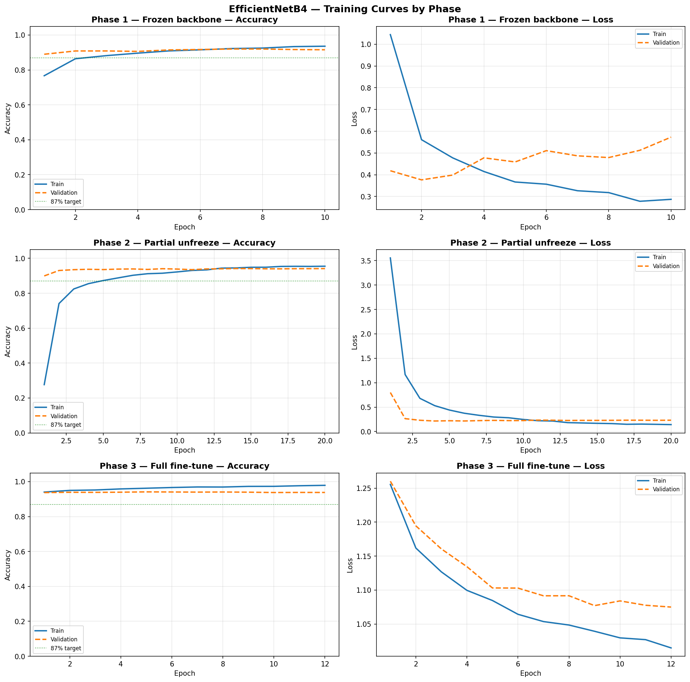
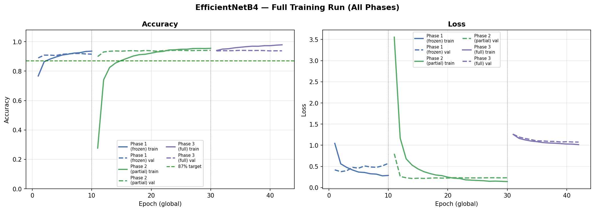
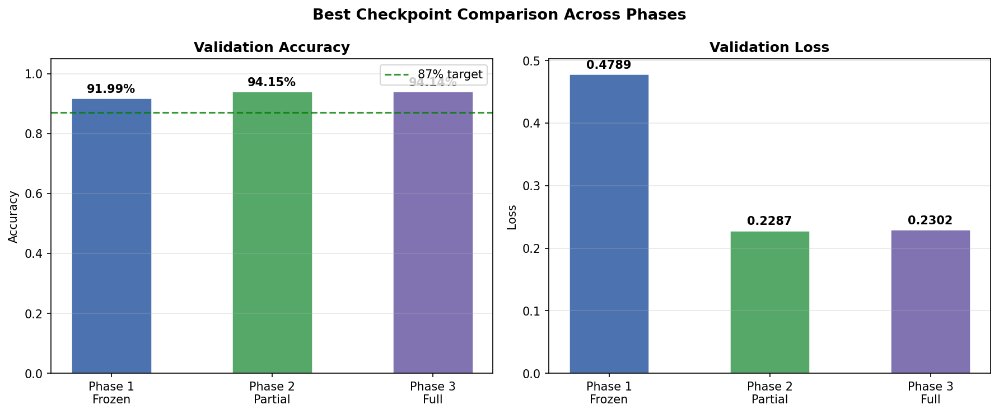
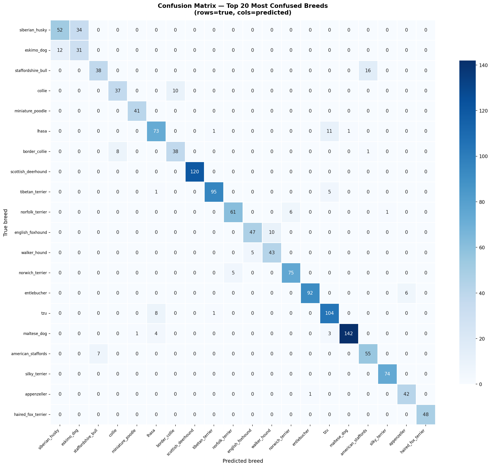
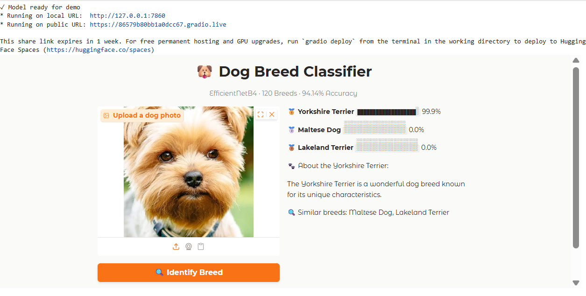

# 🐶 Stanford Dogs Breed Classifier
### EfficientNetB4 Transfer Learning · 120 Breeds · 94.14% Accuracy

[](https://www.kaggle.com/code/megixibrraku/dog-classifier)


---

## Overview

This project trains a fine-grained dog breed classifier on the [Stanford Dogs Dataset](http://vision.stanford.edu/aditya86/ImageNetDogs/) using transfer learning with **EfficientNetB4** pretrained on ImageNet. The model classifies images into **120 dog breeds** and achieves **94.14% validation accuracy**, far exceeding the 87% target.

An interactive **Gradio web demo** is included, allowing anyone to upload a dog photo and get instant breed predictions with confidence scores and breed descriptions powered by Claude (Anthropic).

---

## Results

| Phase | Strategy | Epochs | Best Val Accuracy |
|-------|----------|:------:|:-----------------:|
| Phase 1 | Frozen backbone (bottleneck features) | 10 | 91.99% |
| Phase 2 | Partial unfreeze (top 50 layers) | 16 | **94.15%** |
| Phase 3 | Full fine-tune (all layers except BN) | 12 | **94.14%** |

> ✅ Target (87%) exceeded by **7.14 percentage points**

---

## Training Curves

### Per-Phase Accuracy & Loss


### Combined Training Run


### Best Checkpoint Comparison


---

## Confusion Matrix — Top 20 Most Confused Breeds



> The most confused pairs are visually similar breeds — different Spaniel, Terrier and Retriever types where inter-class differences are subtle even to the human eye.

---

## Sample Predictions


> Green = Correct · Red = Incorrect · Confidence shown in brackets

---

## Model Architecture

- **Backbone**: EfficientNetB4 (pretrained on ImageNet, 380×380 input)
- **Head**: GAP → BN → Dense(1024) → Dropout(0.4) → Dense(512) → Dropout(0.3) → Softmax(120)
- **First layer**: Lambda resize — accepts arbitrary resolution inputs
- **Saved as**: `stanford_dogs.h5`

---

## Training Strategy

Training was split into three progressive phases:

1. **Phase 1 — Frozen backbone**: Bottleneck features pre-computed once, head trained on top. Fast and memory-efficient.
2. **Phase 2 — Partial unfreeze**: Top 50 backbone layers unfrozen with Adam at `2e-5`. BatchNorm kept frozen.
3. **Phase 3 — Full fine-tune**: All layers except BatchNorm unfrozen. Adam at `1e-5` with label smoothing (0.1).

---

## Setup & Usage

### Requirements

```bash
pip install tensorflow tensorflow-datasets gradio anthropic
```

### Run the notebook

1. Open the [Kaggle Notebook](https://www.kaggle.com/code/megixibrraku/dog-classifier)
2. Run all cells sequentially — Phase 1 → 2 → 3 → Visualisations → Demo
3. GPU recommended (P100 or T4). Full run takes ~4–5 hours on Kaggle free tier.

### Run the Gradio demo

The last cell in the notebook launches an interactive demo:
- Upload any dog photo
- Get top 3 breed predictions with confidence scores
- Receive a fun breed description powered by Claude (Anthropic)
- See similar breeds from the predictions
## 🎮 Live Demo

An interactive Gradio demo is included in the last cell of the notebook.
To launch it, run the setup cells then the last cell to get a public URL or try it on https://huggingface.co/spaces/Megi96/MLtest



Upload any dog photo → get top 3 breed predictions + breed info powered by Claude (Anthropic).
### Load the saved model

```python
import tensorflow as tf

# Rebuild architecture first (required due to Lambda layer)
model, _ = build_model(trainable_base=False)
model.compile(optimizer='adam', loss='categorical_crossentropy', metrics=['accuracy'])
model.load_weights("stanford_dogs.h5")
```

### Model Weights

The trained model (`stanford_dogs.h5`, 81MB) exceeds GitHub's file size limit and is not included in this repository. It can be reproduced by running the notebook, or accessed directly from the [Kaggle notebook output](https://www.kaggle.com/code/megixibrraku/dog-classifier).

---

## Project Structure

```
├── Dogs_Classifier.ipynb          # Main training notebook
├── README.md                      # This file
├── training_curves_by_phase.png   # Per-phase accuracy & loss plots
├── training_curves_combined.png   # Full training run combined plot
├── checkpoint_comparison.png      # Best checkpoint bar chart
├── confusion_matrix_top20.png     # Top 20 confused breeds heatmap
└── sample_predictions.png         # Sample prediction grid
```

---

## Dataset

- **Stanford Dogs Dataset** — 20,580 images, 120 breeds
- Split: 12,000 train / 8,580 validation
- Source: `tensorflow_datasets` → `tfds.load("stanford_dogs")`

---

## Acknowledgements

Training conducted on **Kaggle Notebooks** (NVIDIA P100 GPU).
Development assistance by **Claude** (Anthropic, 2024).

### Literature Cited
- Khosla et al. (2011). Novel dataset for fine-grained image categorization. CVPR Workshop.
- Tan & Le (2019). EfficientNet: Rethinking model scaling for CNNs. ICML.
- Deng et al. (2009). ImageNet: A large-scale hierarchical image database. CVPR.
- Chollet et al. (2015). Keras. https://keras.io
- Abadi et al. (2016). TensorFlow: A system for large-scale machine learning. OSDI.
- Anthropic (2024). Claude. https://www.anthropic.com
